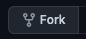
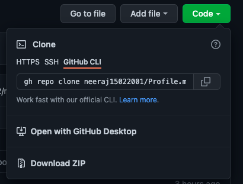
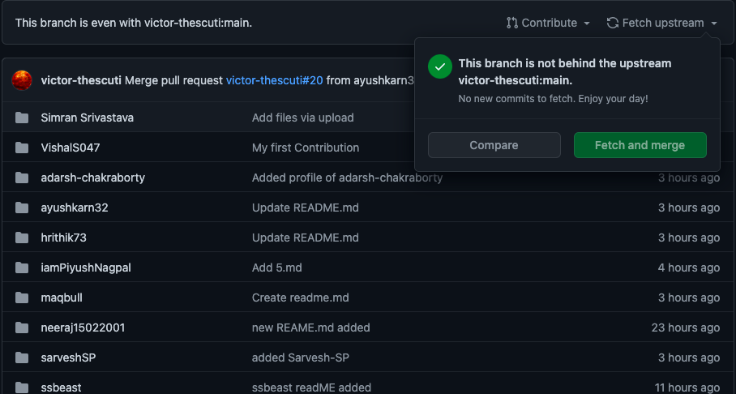
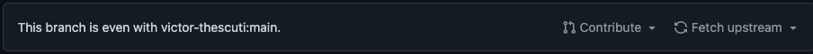

# Start Contributing

### In case you know how to fork follow these steps
1. For contributing in this repository start by creating a **folder** with it's name as your **github username**.
2. Add your markdown code in a file named README.md which should be contained in folder created above.

### In case you don't know how to fork follow these steps
1. Click on **Fork** button on top right corner of main repository.

2. Select your **account** if a popup appears asking where to fork ( occurs in case you are member of any organization).
3. After that navigate to forked repository, **URL** will be like `https://github.com/<your_github_username>/Profile.md/tree/main`.
4. Now, click on green button labelled as **CODE**.

    

5. Now choose either **SSL** or **Github CLI** to clone this forked repository ( HTTPS method is soon going to be deprecated ). For more information click on **Learn More** in popup.

    
6. Click on **COPY** icon  .
7. Now Paste this command in your **Terminal/Powershell**. This will clone forked Repository on your local system.
8. Now make desired changes.
9. Add changes to staging area and commit them with meaningful commit message. ( For More information on Pull Request refer to this video by Official Hactoberfest Team).
    <p><a href="https://hacktoberfest.digitalocean.com/resources?wvideo=tf3u5ruz5y"></a></p><p><a href="https://hacktoberfest.digitalocean.com/resources?wvideo=tf3u5ruz5y">Hacktoberfest 2021</a></p>
10. After commiting the changes, **MAKE SURE TO UPDATE YOUR REMOTE REPOSITORY WITH UPSTREAM**).
11. You can do this by clicking on Fetch and Merge Button.

    
12. Now if this button was enabled ( in my case it is disbled as it is up to date with upstream) click and it will merge changes from upstream to remote repository.
13. Now, you need to fetch these changes, go to command line and rebase your remote branch with local one.
    ```shell
    git fetch origin main
    ```
    ```shell
    git rebase -i origin/main
    ```
    A prompt will appear press colon and write `wq` in vim editor. This is will save your messsage.
14. Now, once branch is rebased and up to date push to remote using
    ```shell
    git push origin main
    ```
15. Now navigate to your forked repository on github and click on **contribute** button.
    

    and click on **OPEN PULL REQUEST** button.
16. Add Pull Request title and description and open pull request.